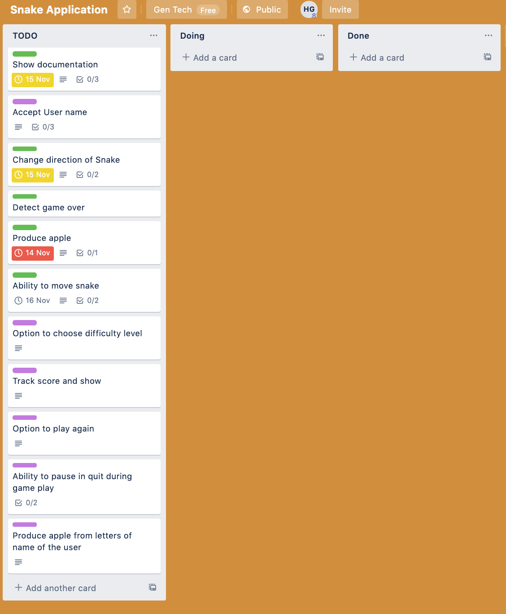
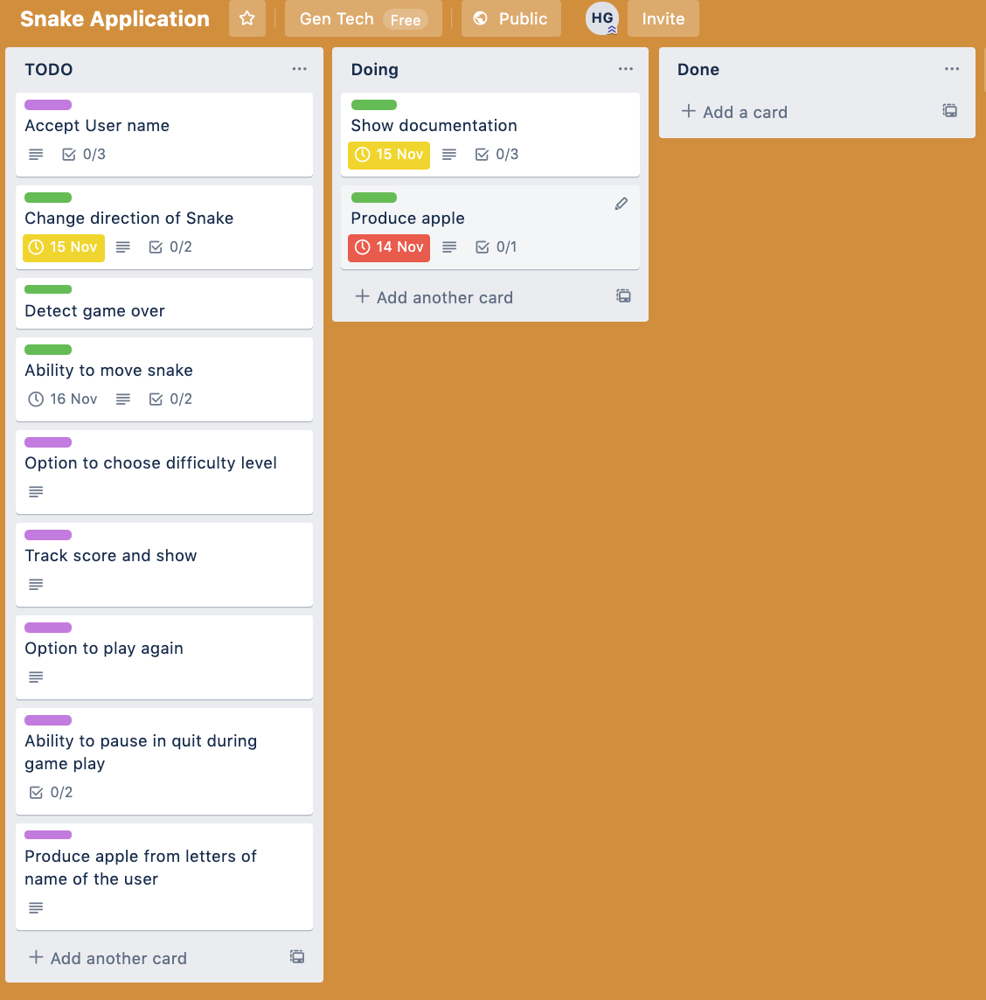
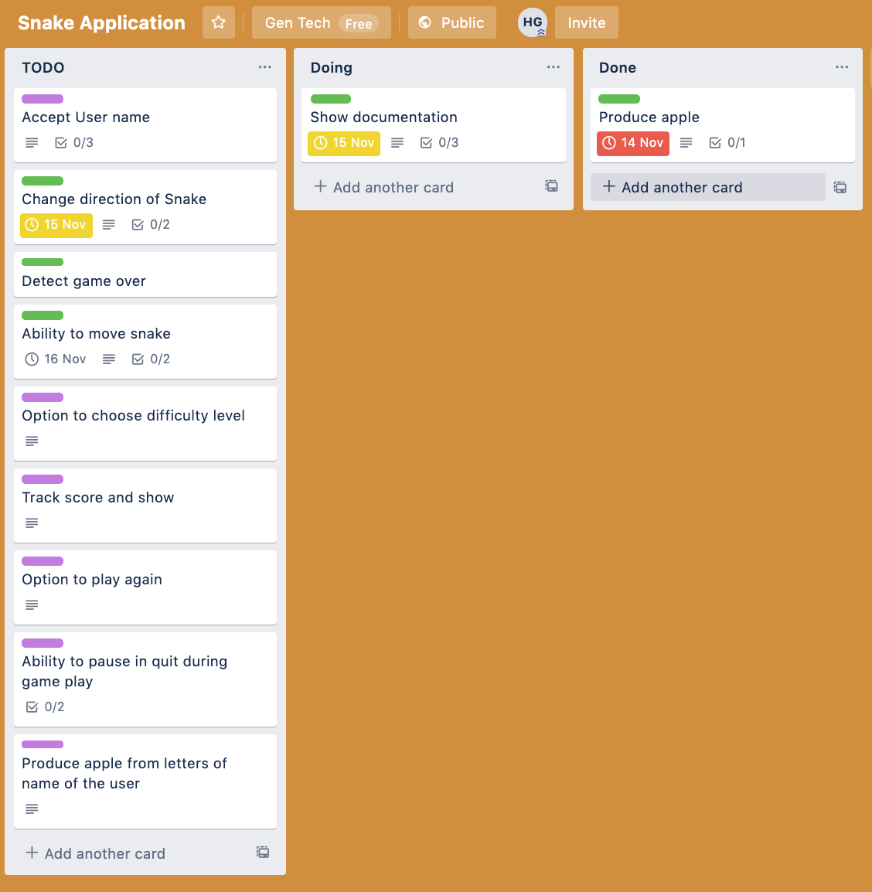
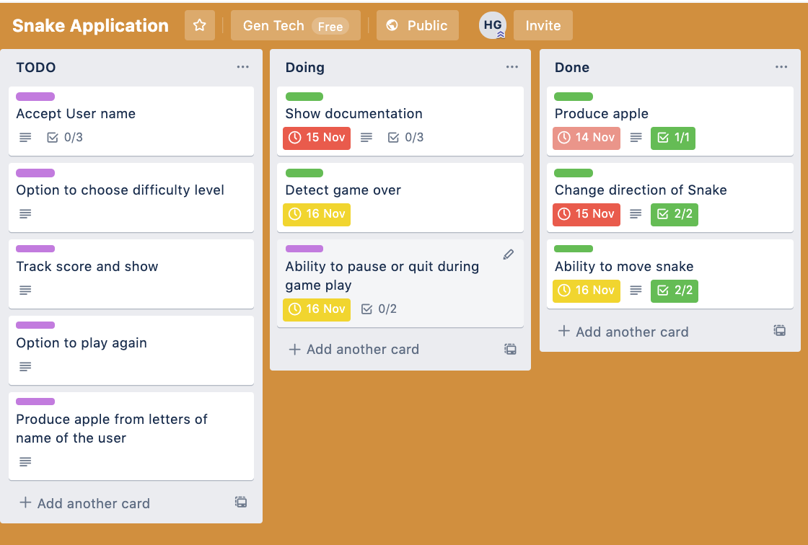
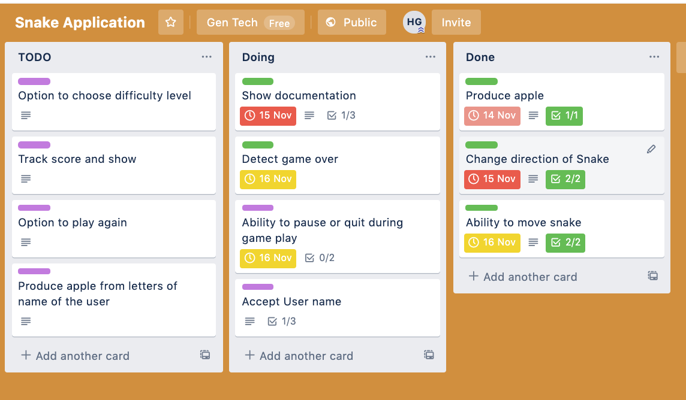
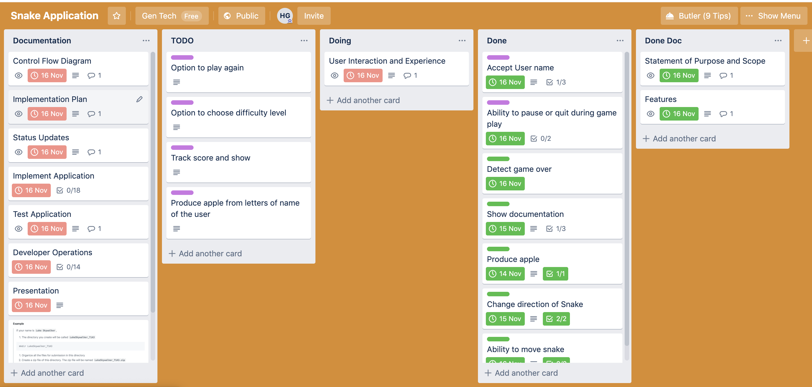
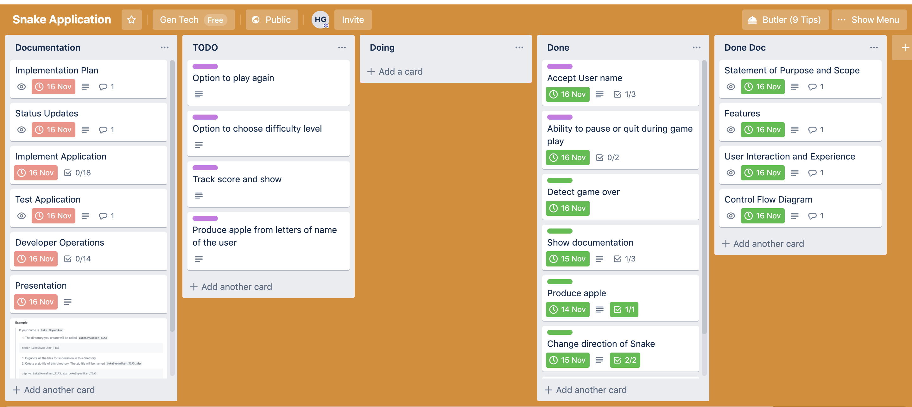
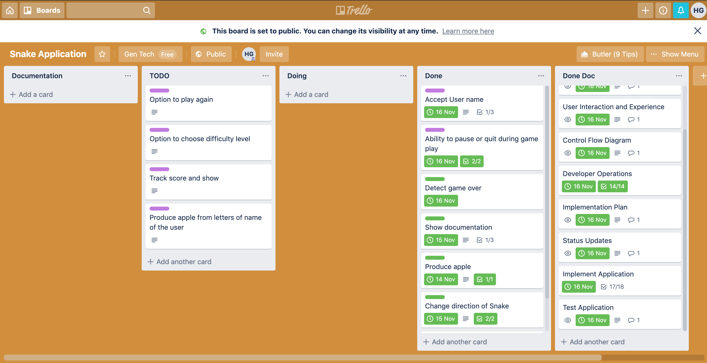

# Purpose and Scope 
## Application functionality 
Snake application is inspired by the Snake game that came with old Nokia phones. In this game, the user is provided with a snake in a square or rectangular box. Once the game starts snake keeps moving in the direction controlled by the user by pressing up, down, left or right keys. The game also regularly produces an apple within the boundaries of the box which can be eaten by a snake if it passes over the apple. This enables the snake to grow and gives a certain number of points to the user. If the snake cuts itself or hits any of the boundaries of the walls. 
The goal of the user is to make a snake eat as many apples as much possible without cutting itself and without hitting any of the walls. 
## Problem Statement
Today's generation has forgotten about good old days of limited functionality not so smart cellular phones. We want to remind the users good old days of snake fun by giving a bit of twist to the snake game. 
## Target Audience
Target audience is mainly the kids who have not got the chance to use old Nokia series phones and to teach them how some of their parents enjoyed limited functionality games in limited colors and simple graphics. Also, the users who have had first-hand experience with the game to continue the fun on the terminal. 
<!-- Ques is this read me file -->
<!-- 
Develop a statement of purpose and scope for your application. It must include:
- describe at a high level what the application will do
- identify the problem it will solve and explain why you are developing it
- identify the target audience
- explain how a member of the target audience will use it	
 -->
# Features
<!-- 
Develop a list of features that will be included in the application. It must include:
- at least THREE features
- describe each feature

Ensure that your features include the following language elements and concepts:
- use of variables and the concept of variable scope
- loops and conditional control structures
- error handling

Note: If the features you described do not require you to use all of the above it is likely that your application is not sophisticated enough. Consult with your educator to check your features are sufficient to address the criteria for T1A2-7. 
-->
## Should explain how to use the game 
At the start of the game, the application should check if the user needs to know how to use the game. If the user chooses to see the help file it should show the help on screen. 
## Should accept user name as input. 
It should be possible to give the user name as an optional command-line argument or else ask for the user name if the command line argument is missing.  
## Should use arrow keys to move the snake in up, down, left and right direction. 
It should be possible to change the direction of the snake by pressing up, down, left, right keys. 
## Should game over if snake cuts itself. 
It should detect if the snake's head overlaps on itself and should end the game for the user. 
## Should game over if the snake hits any of the boundary walls. 
It should detect if snake's head goes over any of the boundary walls of the board and should end the game in that case. 
## Should produce apple which can be eaten by snake to grow. 
The game should produce an apple and place it inside the box. It should detect when snake overlaps on the apple and should regularly produce an apple at a random location within the box every time the previous apple is eaten. 
## Snake should move continuously 
The game should move the snake continuously in the direction chosen by the user. 
## Should accept difficulty level and automatically move the snake in the direction last chosen by the user. 
The game should provide options to chose the difficulty level of the game. Based on the difficulty it should adjust the speed of movement of the snake. 
## Should track user score and display at end of the game. 
The game should reward the user with a certain number of points every time an apple is eaten by the snake and it should keep track of apples eaten by the user as well as update the score. 
## Should allow the user to play again without ending the application. 
When the game ends due to the snake hitting the wall or cutting itself. The application should provide an option to restart a new game without the user needing to start the application again. 
## Should allow the user to quit during the gameplay. 
During the gameplay, it should allow the user to quit the game if the user presses the key "Q" or "q" 
## Should produce with letters from user name and let users win when they build a snake with their name. 
The game should produce letters from the name of the user as an apple which can be eaten by the snake. On each eating of the apple, the letter should be added to the tail of the snake. The user wins when the whole name is produced without cutting itself or without hitting the wall. 
# User Interaction and Experience
<!-- 
Develop an outline of the user interaction and experience for the application.
Your outline must include:
- how the user will find out how to interact with / use each feature
- how the user will interact with / use each feature
- how errors will be handled by the application and displayed to the user
 -->
The user will run index.rb from snake.sh file.
The app will prompt user to to provide the user name if that is not provided in command line arguments.
Unless the user has passed -help flag the app will prompt the user if s/he wants to view the help documentation. 
If user has selected to view the help documentation the app will show the contents of help.txt from the help directory.
Once the app has handled all above events the snake board will be displayed with a red "a" to represent apple and an "@" sign representing snake head.

At this point the app will wait for user input
If the user presses
1. Up arrow key, the snake will move in up direction.
2. Down arrow key, the snake will move in down direction.
3. Left arrow key, the snake will move in left direction.
4. Right arrow key, the snake will move in right direction.
5. "P" or "p" key, the game will pause and display a message to press any key to resume the game.
6. "q" or "Q" key, the app will pause, display a message to confirm if the user if s/he wants to quit the game. If user selects to quit by pressing enter/return key the app will stop.
7. Any other key the app will sound a beep to indicate invalid input and move the snake in the direction previously chosen by the user.

The app will keep taking input and perform actions outlined above until the snake steps over its own tail or it hits one of the boundary walls and then the game will end after displaying a message "Gave over. Better luck next time!"

# Control Flow Diagram	

<!-- 
Develop a diagram which describes the control flow of your application. Your diagram must:
- show the workflow/logic and/or integration of the features in your application for each feature.
- utilise a recognised format or set of conventions for a control flow diagram, such as UML.
 -->
Click [here](https://www.draw.io/#Hhirengondhiya%2Fname_snake_game%2Fmaster%2Fdocumentation%2Fctrl-flow-diagram%2Fsnake_game.drawio) to view the control flow diagram on [draw.io](https://www.draw.io/)

Please note you need to authorize [draw.io](https://www.draw.io/) to use your GitHub account.
# Implementation Plan
<!-- 
Develop an implementation plan which:
- outlines how each feature will be implemented and a checklist of tasks for each feature
- prioritise the implementation of different features, or checklist items within a feature
- provide a deadline, duration or other time indicator for each feature or checklist/checklist-item
 -->
 I have used Trello to manage implementation of the app. The board can be accessed from [here](https://trello.com/b/K7fXmhTH/snake-application).

 Below screen prints represents state of the board at various points of implemenation
1. Initial State

2. 

3. 

4. 

5. 

6. 

7. 

8. Final Sate

# Status Updates
All the status updates can be found [here](development-log.md)